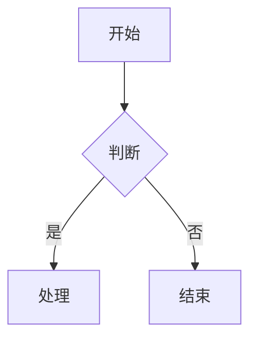
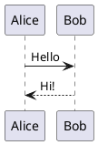

# Lark-flavored Markdown 语法参考

文档内容使用 **Lark-flavored Markdown** 格式，这是标准 Markdown 的扩展版本，支持飞书文档的所有块类型和富文本格式。

## 通用规则

- 使用标准 Markdown 语法作为基础
- 使用自定义 XML 标签实现飞书特有功能（具体标签见各功能章节）
- 需要显示特殊字符时使用反斜杠转义：`* ~ ` $ [ ] < > { } | ^`

---

## 📝 基础块类型

### 文本（段落）

```markdown
普通文本段落

段落中的**粗体文字**

多个段落之间用空行分隔。

居中文本 {align="center"}
右对齐文本 {align="right"}
```

**段落对齐**：支持 `{align="left|center|right"}` 语法。可与颜色组合：`{color="blue" align="center"}`

### 标题

飞书支持 9 级标题。H1-H6 使用标准 Markdown 语法，H7-H9 使用 HTML 标签：

```markdown
# 一级标题
## 二级标题
### 三级标题
#### 四级标题
##### 五级标题
###### 六级标题
<h7>七级标题</h7>
<h8>八级标题</h8>
<h9>九级标题</h9>

# 带颜色的标题 {color="blue"}
## 红色标题 {color="red"}
# 居中标题 {align="center"}
## 蓝色居中标题 {color="blue" align="center"}
```

**标题属性**：支持 `{color="颜色名"}` 和 `{align="left|center|right"}` 语法，可组合使用。颜色值：red, orange, yellow, green, blue, purple, gray。

### 列表
有序列表,无序列表嵌套使用tab或者 2 空格缩进
```markdown
- 无序项1
  - 无序项1.a
  - 无序项1.b

1. 有序项1
2. 有序项2

- [ ] 待办
- [x] 已完成
```

### 引用块

```markdown
> 这是一段引用
> 可以跨多行

> 引用中支持**加粗**和*斜体*等格式
```

### 代码块

**⚠️** 只支持围栏代码块（` ``` `），不支持缩进代码块。

````markdown
```python
print("Hello")
```
````

支持语言：python, javascript, go, java, sql, json, yaml, shell 等。

### 分割线

```markdown
---
```

---

## 🎨 富文本格式

### 文本样式

`**粗体**` `*斜体*` `~~删除线~~` `` `行内代码` `` `<u>下划线</u>`

### 文字颜色

`<text color="red">红色</text>` `<text background-color="yellow">黄色背景</text>`

支持: red, orange, yellow, green, blue, purple, gray

### 链接

`[链接文字](https://example.com)` （不支持锚点链接）

### 行内公式（LaTeX）

`$E = mc^2$`（`$`前后需空格）或 `<equation>E = mc^2</equation>`（无限制，推荐）

---

## 🚀 高级块类型

### 高亮块（Callout）

```html
<callout emoji="✅" background-color="light-green" border-color="green">
支持**格式化**的内容，可包含多个块
</callout>
```

**属性**: emoji (使用emoji 字符如 ✅ ⚠️ 💡), background-color, border-color, text-color

**背景色**: light-red/red, light-blue/blue, light-green/green, light-yellow/yellow, light-orange/orange, light-purple/purple, pale-gray/light-gray/dark-gray

**常用**: 💡light-blue(提示) ⚠️light-yellow(警告) ❌light-red(危险) ✅light-green(成功)

**限制**: callout子块仅支持文本、标题、列表、待办、引用。不支持代码块、表格、图片。

### 分栏（Grid）

适合对比、并列展示场景。支持 2-5 列：
#### 两栏（等宽）

```html
<grid cols="2">
<column>

左栏内容

</column>
<column>

右栏内容

</column>
</grid>
```
#### 三栏自定义宽度
```html
<grid cols="3">
<column width="20">左栏(20%)</column>
<column width="60">中栏(60%)</column>
<column width="20">右栏(20%)</column>
</grid>
```

**属性**: `cols`(列数 2-5), `width`(列宽百分比，总和为100，等宽时可省略)

### 表格

#### 标准 Markdown 表格

```markdown
| 列 1 | 列 2 | 列 3 |
|------|------|------|
| 单元格 1 | 单元格 2 | 单元格 3 |
| 单元格 4 | 单元格 5 | 单元格 6 |
```

#### 飞书增强表格

当单元格需要复杂内容（列表、代码块、高亮块等）时使用。

**层级结构**（必须严格遵守）：
```
<lark-table>                    ← 表格容器
  <lark-tr>                     ← 行（直接子元素只能是 lark-tr）
    <lark-td>内容</lark-td>     ← 单元格（直接子元素只能是 lark-td）
    <lark-td>内容</lark-td>     ← 每行的 lark-td 数量必须相同！
  </lark-tr>
</lark-table>
```

**属性**：
- `column-widths`：列宽，逗号分隔像素值，总宽≈730
- `header-row`：首行是否为表头（`"true"` 或 `"false"`）
- `header-column`：首列是否为表头（`"true"` 或 `"false"`）

**单元格写法**：内容前后必须空行
```html
<lark-td>

这里写内容

</lark-td>
```

### 图片

```html
<image url="https://example.com/image.png" width="800" height="600" align="center" caption="图片描述文字"/>
```

**属性**: url (必需，系统会自动下载并上传), width, height, align (left/center/right), caption

### 画板（Mermaid / PlantUML 图表）

**图表优先选择 Mermaid**. mermaid图表会被渲染为可视化的画板。

````markdown

````

**支持图表类型**: flowchart, sequenceDiagram, classDiagram, stateDiagram, gantt, mindmap, erDiagram

PlantUML 适用于 Mermaid 满足不了的场景：

````markdown

````

---

## 🎯 最佳实践

- **空行分隔**：不同块类型之间用空行分隔
- **转义字符**：特殊字符用 `\` 转义：`\*` `\~` `\``
- **图片**：使用 URL，系统自动下载上传
- **分栏**：列宽总和必须为 100
- **表格选择**：简单数据用 Markdown，复杂嵌套用 `<lark-table>`
- **目录**：飞书自动生成，无需手动添加
- **禁止重复标题**：文档 markdown 内容开头不要写与 title 参数相同的一级标题
